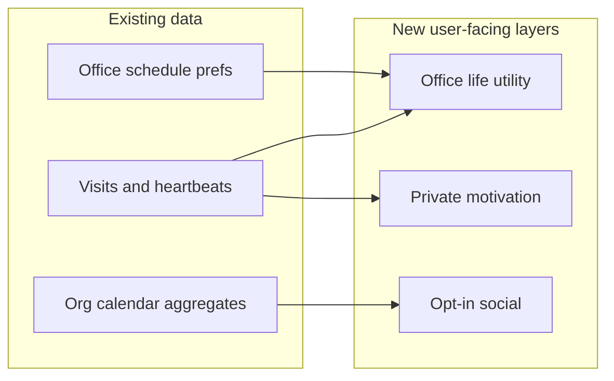

# Engagement & office-life feature ideas

## Current baseline

My Office Pulse is strong on **solo compliance** (5h/day, 8 office days/month, agent tracking, year calendar, HR exemptions) but has **no gamification, social layer, or peer visibility**. Rich data already exists:

- Per-user visits, daily hours, first check-in, pulse timeline
- Admin-only **in-office-now** ([`src/app/api/admin/in-office-now/route.ts`](src/app/api/admin/in-office-now/route.ts)) and **org calendar** ([`src/lib/admin-reports.ts`](src/lib/admin-reports.ts))
- Schedule inference ([`src/lib/office-schedule.ts`](src/lib/office-schedule.ts)) and behind-hours nudges
- In-app notifications backend ready; **bell UI not wired** ([`InAppNotificationPanel`](src/components/InAppNotificationPanel.tsx) exists but is not mounted in nav)

Your choices: **opt-in social** + balanced priority across **utility**, **motivation**, and **polish**.

---

## Phase 1 — Quick wins (1–2 weeks, high impact, low risk)

### Polish & discoverability
| Idea | Why it's fun/useful | Build on |
|------|---------------------|----------|
| **Wire notification bell** | Users see hours-met, behind, admin replies without checking Teams | Existing `InAppNotificationPanel` + dismiss API |
| **Daily micro-celebration** | Confetti or pulse animation when 5h target met (once per day, dismissible) | Dashboard hero already shows `metTarget` |
| **"You're on track" insights** | One-line tip: "2 more office days to hit monthly target" or "Usually in by 9:15 — today 9:02" | [`monthly-progress.ts`](src/lib/monthly-progress.ts), visit history |
| **Welcome back nudge** | After 3+ days away: "Welcome back — here's your month at a glance" | `User.createdAt`, last visit |

### Utility (office life)
| Idea | Why it's fun/useful | Build on |
|------|---------------------|----------|
| **"Who's in today" (opt-in)** | See colleagues who opted in and are currently in office — replaces walking the floor | Promote admin `in-office-now` logic to a user API with **visibility toggle** in Settings |
| **Best days to come in** | "Tue/Wed are busiest in your team — good days for collaboration" | Org calendar day aggregates (anonymized counts, no names until opt-in) |
| **My office rhythm** | Personal chart: typical arrival time, avg hours by weekday | Already partially in schedule suggestion |

**Privacy guardrail:** Default **off** for social visibility; clear copy: "Only colleagues who opt in appear; hours/compliance never shown."

---

## Phase 2 — Motivation without gaming compliance (2–4 weeks)

Compliance apps must not reward **cheating** (fake check-ins). Motivation should celebrate **real patterns**, not rank people by hours.

### Personal streaks & milestones (private by default)
| Feature | Example | Rules |
|---------|---------|-------|
| **Office-day streak** | "4 weeks in a row hitting monthly target" | Count completed months only |
| **Early bird / consistent** | "In office by 9:30 on 12 of last 15 days" | Opt-in badge on own dashboard only |
| **Milestone cards** | 50th office day logged, 100h in office, first full FY green | Unlock quietly; share to Teams optional |

### Gentle team energy (opt-in social)
| Feature | Example | Opt-in |
|---------|---------|--------|
| **Team pulse** | "12 people in office today" (count only, no names) | Everyone sees aggregate |
| **Buddy list** | Pin 3–5 colleagues; see if they're in (not hours) | Both must opt in OR viewer-only |
| **Floor cheer** | Anonymous: "Someone just hit their 5h today" (no name) | Org-wide mood, not leaderboard |

**Avoid:** Public leaderboards by hours, naming lowest performers, or comparing compliance scores — toxic in a PwC pilot and invites gaming.

---

## Phase 3 — Deeper office-life utility (4–8 weeks)

### Interactive & planning
| Feature | User value |
|---------|------------|
| **"Plan my week"** | Pick target office days; app suggests which days based on team density + your schedule prefs |
| **OOO + office planner** | When marking OOO, show impact on monthly progress ("You'll need 6 of remaining 9 days") |
| **Visit timeline story** | Swipeable week view: "Mon 5.2h, Tue 0h, Wed 4.8h" with visit segments — more visual than tables |
| **Quick actions widget** | Check in, mark OOO, contact admin, search — one card on Today |

### Admin → user bridges (already built, user-facing)
| Feature | Source |
|---------|--------|
| In-office directory | [`InOfficeNowPanel`](src/components/InOfficeNowPanel.tsx) pattern |
| Org heatmap lite | Simplified org calendar: "How busy was Tuesday?" without user drill-down |

### Integrations (medium effort)
| Feature | Notes |
|---------|-------|
| **Teams adaptive card** | "3 teammates in office" with link to portal — extend Power Automate payloads |
| **Calendar export** | iCal of planned office days (not visits) for Outlook |
| **Weekly digest** | Friday email/Teams: your week summary + next week suggestion |

---

## Phase 4 — Delight & retention hooks

| Idea | Description |
|------|-------------|
| **Seasonal themes** | Subtle UI variants (festive week, year-end FY summary card) |
| **FY yearbook** | End of fiscal year: personal summary PDF — days in office, streaks, green months |
| **Feedback loop** | After hitting monthly target: "How was office this month?" 1-tap poll → feeds admin contact categories |
| **Changelog gamification** | "You discovered 3 features this week" via search/help usage (privacy-safe, no tracking PII) |
| **Agent personality** | Friendly agent status copy: "Pulse steady" vs "Stale — laptop asleep?" |

---

## Recommended first bundle (if you pick one sprint)

Given opt-in social + balanced A/B/C priority, ship this **MVP engagement pack**:

1. **Notification bell** in nav (polish — already 80% built)
2. **"Who's in" opt-in panel** on Today (utility + social)
3. **Personal insights strip** under hero: streak + monthly days left + typical check-in (motivation + utility)
4. **Target-met celebration** micro-animation (motivation, 1 day effort)
5. **Settings → Privacy**: toggles for "Show me in Who's in" and "Show my name to opted-in colleagues"

Estimated touchpoints: [`AppNav.tsx`](src/components/AppNav.tsx), [`dashboard/page.tsx`](src/app/dashboard/page.tsx), new `src/lib/user-visibility.ts`, extend [`prisma/schema.prisma`](prisma/schema.prisma) with `showInOfficeDirectory` on User or NotificationPrefs.

---

## What NOT to do (pilot context)

- Mandatory social features or exposing compliance status to peers
- Leaderboards tied to hours or monthly targets
- Rewards that incentivize manual check-in abuse
- Heavy gamification before agent data quality is trusted
- Features that duplicate official HR systems (badge access, booking systems)

---

## Success metrics (lightweight)

- **Activation:** % users with agent connected + 1 visit in first 7 days
- **Return:** weekly active users on `/dashboard`
- **Opt-in social:** % enabling "Who's in" after seeing the panel
- **Support load:** admin contact threads tagged "bug" vs "feedback" ratio
- **Qualitative:** pilot survey — "Would you open this before coming to office?"

---

## Next step

Confirm which **Phase 1 items** you want built first (recommended bundle above vs. cherry-pick). Implementation can follow existing patterns: server components for Today, client panels for interactive bits, admin APIs reused with user-scoped RBAC and opt-in flags.
